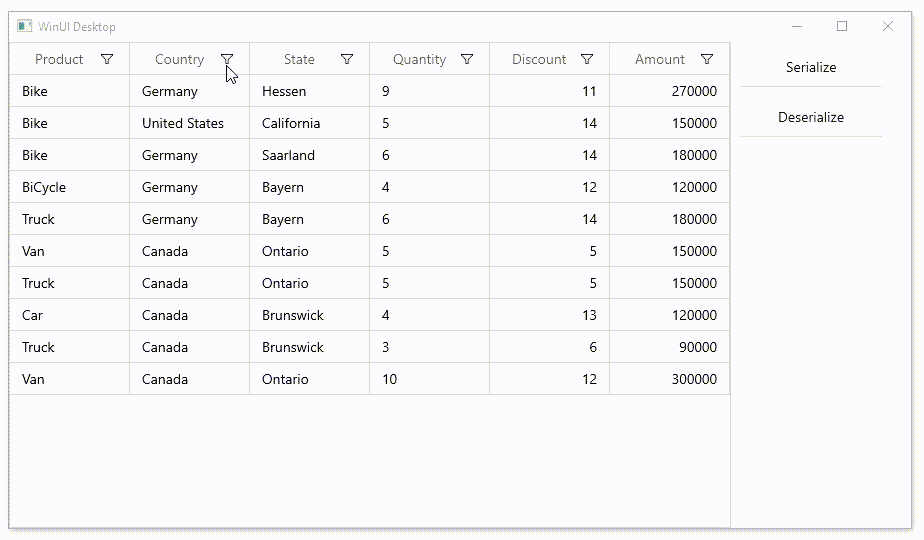

# How to save and reload filters in WinUI DataGrid?

## About the sample

This example describes how to save and reload filters in WinUI DataGrid.

[WinUI DataGrid](https://www.syncfusion.com/winui-controls/datagrid) (SfDataGrid) allows you to save and load the grid settings using the [SfDataGrid.Serialize](https://help.syncfusion.com/cr/winui/Syncfusion.UI.Xaml.DataGrid.SfDataGrid.html#Syncfusion_UI_Xaml_DataGrid_SfDataGrid_Serialize_Windows_Storage_StorageFile_) and [SfDataGrid.Deserialize](https://help.syncfusion.com/cr/winui/Syncfusion.UI.Xaml.DataGrid.SfDataGrid.html#Syncfusion_UI_Xaml_DataGrid_SfDataGrid_Deserialize_Windows_Storage_StorageFile_) methods. You can customize this process by passing [SerializationOptions](https://help.syncfusion.com/cr/winui/Syncfusion.UI.Xaml.DataGrid.Serialization.SerializationOptions.html) and [DeserializationOptions](https://help.syncfusion.com/cr/winui/Syncfusion.UI.Xaml.DataGrid.Serialization.DeserializationOptions.html) as parameters to these methods. [SerializationOptions](https://help.syncfusion.com/cr/winui/Syncfusion.UI.Xaml.DataGrid.Serialization.SerializationOptions.html) and [DeserializationOptions](https://help.syncfusion.com/cr/winui/Syncfusion.UI.Xaml.DataGrid.Serialization.DeserializationOptions.html) contains a set of properties that is used to customize the serialization/deserialization process.

You can enable or disable the serialization of filters in DataGrid by setting [SerializationOptions.SerializeFiltering](https://help.syncfusion.com/cr/winui/Syncfusion.UI.Xaml.DataGrid.Serialization.SerializationOptions.html#Syncfusion_UI_Xaml_DataGrid_Serialization_SerializationOptions_SerializeFiltering) property as illustrated in the following code example.

``` C#

private void OnSerializationClicked(object sender, RoutedEventArgs e)
{
      if (dataGrid == null) return;
      var serializationOptions = new SerializationOptions()
      {
            SerializeFiltering = true,
      };
      using (var file = File.Create("DataGrid.xml"))
      {
            dataGrid.Serialize(file, serializationOptions);
      }
}

```

In the same way, you can enable or disable deserialization of serialized filters to DataGrid by setting [DeserializationOptions.DeserializeFiltering](https://help.syncfusion.com/cr/winui/Syncfusion.UI.Xaml.DataGrid.Serialization.DeserializationOptions.html#Syncfusion_UI_Xaml_DataGrid_Serialization_DeserializationOptions_DeserializeFiltering) property as illustrated in the following code example.

``` C#

private void OnDeSerializationClicked(object sender, RoutedEventArgs e)
{
      if (dataGrid == null) return;
      var deserializationOptions = new DeserializationOptions()
      {
           DeserializeFiltering = true,
      };
      using (var file = File.Open("DataGrid.xml", FileMode.Open))
      {
           if (deserializationOptions.DeserializeFiltering == true)
           {
               dataGrid.Deserialize(file, deserializationOptions);
           }
      }
}

```



Take a moment to peruse the [WinUI DataGrid - Serialization and Deserialization](https://help.syncfusion.com/winui/datagrid/serialization-and-deserialization) documentation, where you can find about serialization and deserialization with code examples.

## Requirements to run the demo
Visual Studio 2019 and above versions
